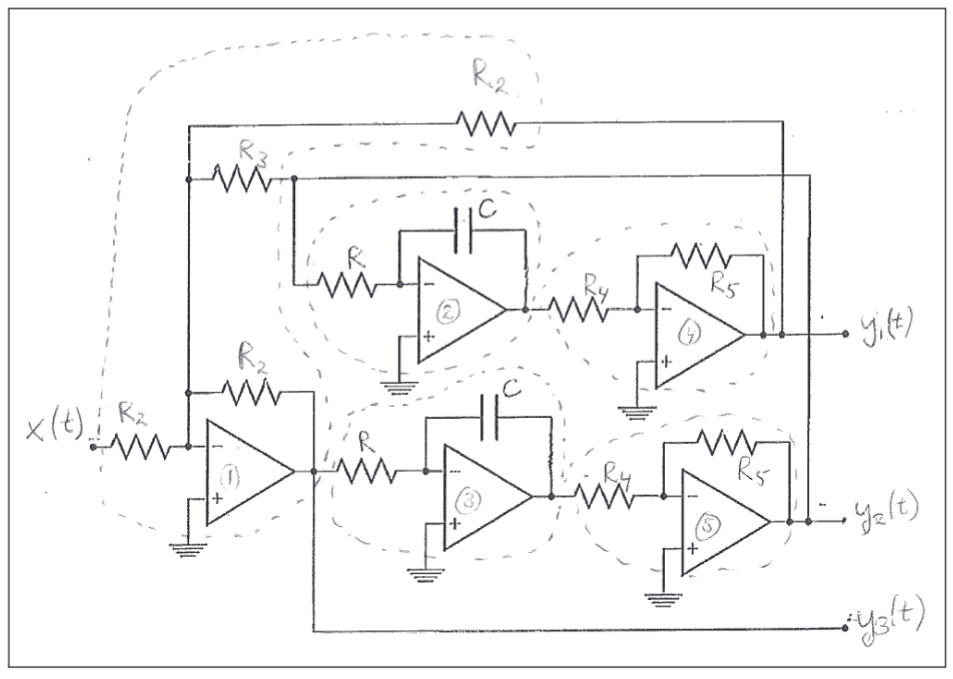
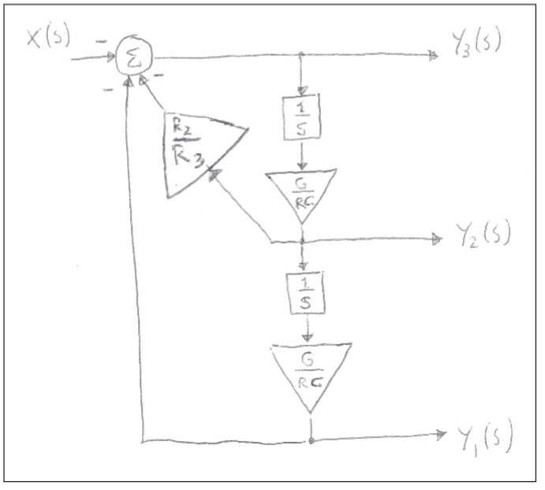

# Analog-Digital-Systems-Analysis

This project focused on analyzing a continuous-time second-order active filter and then
designing a complete digital sampling system suitable for measurement applications.

## Part 1 — Analysis of Analog Filters

This section examines a second-order active filter implemented using operational
amplifiers, resistors, and capacitors. Depending on which output is taken
(y₁(t), y₂(t), or y₃(t)), the circuit realizes three different filter types.

### MATLAB Functions Used
- tf — LTIC system objects
- lsim — time-domain simulation
- iopzplot — pole-zero plots
- impulse — impulse responses
- bode — magnitude/phase plots
- repmat — periodic signal construction

### Circuit Description
The circuit (Figure 1) uses five operational amplifiers:
- OP1: inverting summer
- OP2, OP3: inverting integrators
- OP4, OP5: inverting amplifiers

Both integrators share the same R and C. The amplifier gain is:

    -G = -R5 / R4   (with G > 0)

### Objective
Derive and analyze the three transfer functions:

    H1(s), H2(s), H3(s)

corresponding to the three analog outputs of the circuit.

## Part 1.2 — Derivation of Transfer Functions

**Task:**  
Using the flow diagram in Figure 2, derive the transfer functions relating X(s)
to Y1(s), Y2(s), and Y3(s).

**Execution:**  
I started with H3(s), the simplest to extract from the diagram, and then used
algebraic relations to obtain H1(s) and H2(s). These expressions form the basis
for the later system-level analysis.

## Part 1.3 — MATLAB Visualization of the Transfer Functions

To study the behavior of H1(s), H2(s), and H3(s), I created a parameterized MATLAB
script that:

- (a) plots pole–zero diagrams with iopzplot
- (b) simulates impulse responses using impulse
- (c) generates Bode diagrams using bode
- (d) stores all parameters (R, C, G, etc.) in one place for quick adjustment

Changing any component updates all plots automatically, making it easy to explore
how different designs affect stability and bandwidth.

## Part 1.5 — Filter Types

Based on their frequency responses:

- H1(s) → Low-Pass (LP)
- H2(s) → High-Pass (HP)
- H3(s) → Band-Pass (BP)

These classifications follow from the Bode and pole–zero plots.

## Part 1.7 — Periodic Input and Fourier Content

I selected a periodic waveform with a known Fourier series (fundamental + harmonics,
100 Hz). Using MATLAB, I:

- generated a finely sampled periodic signal,
- applied the LP filter using tf and lsim,
- plotted input and output together.

The LP filter suppresses the higher harmonics, producing a smoother, more sinusoidal
output dominated by the 100 Hz fundamental.

# Part 2 — Design of a Sampling Measurement System

This section designs a complete system for sampling a continuous-time signal whose
information is carried by sinusoids:

- Useful signal: sinusoids up to 8 kHz, amplitude ≤ 1 V
- Interference: single high-frequency sinusoid ≥ 11 kHz, amplitude ≤ 1 V
- No energy between 8 kHz and 11 kHz

## 1. Sampling Frequency
Select a sampling frequency well above 2 · 8 kHz so that the useful band is preserved
and interference ≥ 11 kHz can be rejected before aliasing.

## 2. Anti-Aliasing Filter Specification
Define a low-pass analog filter with:

- Passband: 0–8 kHz (minimal attenuation)
- Stopband: ≥ 11 kHz (strong attenuation of interference)

## 3. Analog Filter Design (Butterworth / Chebyshev I)
Using MATLAB’s analog filter tools (`butter`, `cheby1`, etc. with the 's' argument):

- I selected a standard prototype (e.g., Butterworth for a flat passband),
- Designed the LP filter to satisfy the specification,
- Verified the design with pole–zero and Bode plots.

## 4. Simulation of Continuous-Time + Sampling

In MATLAB, I built a script that:

- constructs the analog filter (tf),
- creates a test signal:  
  one sinusoid in 0–8 kHz and one ≥ 11 kHz,
- simulates filtering using lsim on a fine time grid (integer fraction of Ts),
- performs sampling by reading lsim output at the sampling instants.

## 5. FFT Analysis
For the sampled signal, I:

- computed the FFT with a frequency axis in kHz,
- normalized the amplitude so a 1 V sinusoid produces a spectral peak of height 1,
- verified that the useful 0–8 kHz component remains while ≥ 11 kHz interference
  is suppressed.

Together, the anti-aliasing filter, sampling process, and FFT form a complete
measurement chain that preserves the desired information band and rejects
high-frequency disturbances.

